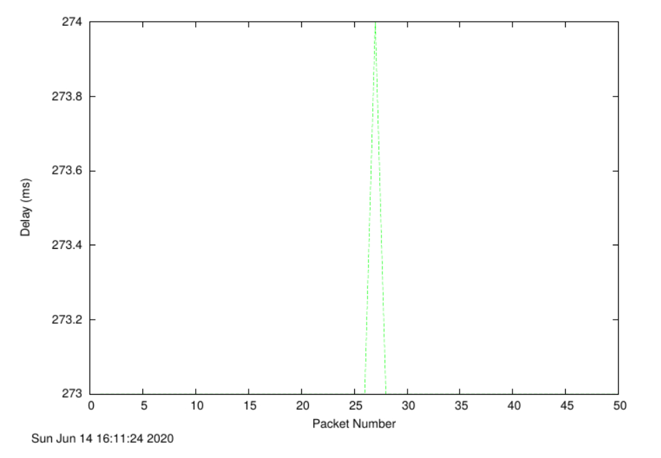

# Exercise 1: nslookup

## 1. Which is the IP address of the website www.koala.com.au? In your opinion, what is the reason of having several IP addresses as an output?

### Facts

- IP(Internet Protocol) addresses are assigned to each device connected to a computer network that uses IP for communication.
- IP addresses serve two main functions:
  - Host
  - Location addressing

### Answer

www.koala.com.au has IP addresses:
- 104.18.61.21
- 172.67.219.46
- 104.18.60.21

Having several IP addresses allow for sites to have different server locations, allowing users to connect to the closest server and reduce ping times and/or prevent connecting to an already congested server.

## 2. Find out the name of the IP address 127.0.0.1. What is special about this IP address?

The name of the IP address is:
- localhost

What's special about this IP address is that it allows for a network service to run locally (i.e. The server is hosted on the users machine).

# Exercise 2: Use ping to test host reachability:

Are the following hosts reachable from your machine by using ping:

## www.unsw.edu.au

- reachable (ping)
- reachable (website)

## www.getfittest.com.au

- unreachable (ping)
  - unknown host
- unreachable (website)

## www.mit.edu

- reachable (ping)
- reachable (website)

## www.intel.com.au

- reachable (ping)
- reachable (website)

## www.tpg.com.au

- reachable (ping)
- reachable (website)

## www.hola.hp

- unreachable (ping)
  - unknown host
- unreachable (website)

## www.amazon.com

- reachable (ping)
- reachable (website)

## www.tsinghua.edu.cn

- reachable (ping)
- reachable (website)

## www.kremlin.ru

- unreachable (ping)
  - firewall
- reachable (website)

## 8.8.8.8

- reachable (ping)
- unreachable (website)

# Exercise 3: Use traceroute to understand network topology

## 1. How many routers are there between your workstation and www.columbia.edu?


From the image above, there are 22 routers between my workstation and www.columbia.edu.

### How many routers along the path are part of the UNSW network?

4

### Between which two routers do packets cross the Pacific Ocean?

The 9th and 10th routers are when the packets cross the Pacific Ocean.

## 2. Run traceroute from your machine to the following destinations:

### www.ucla.edu


### www.u-tokyo.ac.jp


### www.lancaster.ac.uk


### At which router do the paths from your machine to these three destinations diverge? Find out further details about this router.

Router 6 (138.44.5.0 - Australian Academic and Research Network) is when the paths diverge.

### Is the number of hops on each path proportional the physical distance?

Japan is geographically closer to NSW than the United States.

Japan has 16 hops, whereas the United States has 14 hops.

Hence, the number of hops on each path is not proportional to physical distance.

## 3. Several servers distributed around the world provide a web interface from which you can perform a traceroute to any other host in the Internet. Run traceroute from both these servers towards your machine and in the reverse direction.

### Speedtest

- From

- To


### Telstra

- From

- To


### What are the IP addresses of the two servers that you have chosen. Does the reverse path go through the same routers as the forward path?

- Speedtest: 202.150.221.170
- Telstra:  203.50.5.178

The reverse path doesn't go through the same routers as the forward path.

### If you observe common routers between the forward and the reverse path, do you also observe the same IP addresses? Why or why not?

The common routers observed do not have the same IP addresses.
- There are more efficient paths to take than the reverse path, hence the different IP addresses.

# Exercise 4: Use ping to gain insights into network performance

- www.uq.edu.au
  - Delay

  
  - Scatter

  
  - Average

  

- www.dlsu.edu.ph
  - Delay

  
  - Scatter

  
  - Average

  

- www.tu-berlin.de
  - Delay

  
  - Scatter

  
  - Average

  

## 1.
- Distances:

```
UNSW->UQ: 733880 m (456.01 mi)
UNSW->DLSU: 6248510 m (3,882.64 mi)
UNSW->TU: 16105090 m (10,007.24 mi)
```

- Speed of light:

```
300000000 m/s
```

- Shortest possible time:

```
UNSW->UQ: 733800/300000000 = 0.00245 s
UNSW->DLSU: 6248510/300000000 = 0.02083 s
UNSW->TU: 16105090/300000000 = 0.05368 s
```

- RTT

```
UNSW->UQ: 16.5ms
UNSW->DLSU: 299ms
UNSW->TU: 273ms
```

- RTT/T

```
UNSW->UQ: 16.5ms / 0.00245*1000 ms = 6.73
UNSW->DLSU: 299ms / 0.02083*1000 ms = 14.35
UNSW->TU: 273ms / 0.05368*1000 ms = 5.09
```

- RTT/T vs Distance


### Can you think of at least two reasons why the y-axis values that you plot are greater than 2?

The best case scenario for rtt/t is 2, as light travels to and from. The speed can't be greater than the speed of light because:

- Routers must also take time to analyze the header of the packet.
- Firewall configurations

Hence, the y-axis values are greater than 2.

## 2. Is the delay to the destinations constant or does it vary over time? Explain why.

Varies over time due to propagation, processing and queuing delays.

## 3. Explore where the website for www.epfl.ch is hosted. Is it in Switzerland?

Yes

## 4. The measured delay (i.e., the delay you can see in the graphs) is composed of propagation delay, transmission delay, processing delay and queuing delay. Which of these delays depend on the packet size and which do not?

Only transmisson delay is dependant on packet size, the rest aren't.