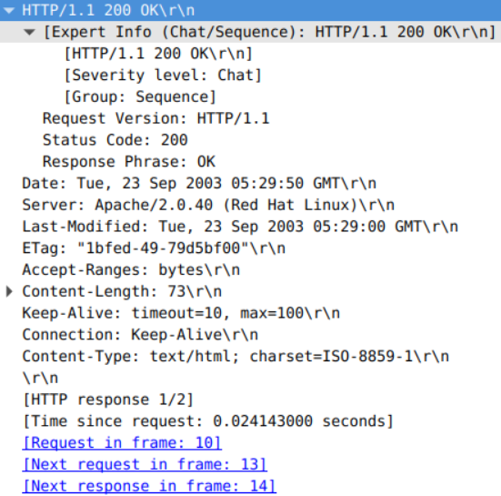
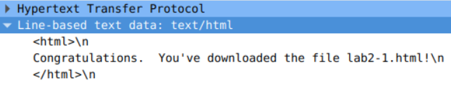
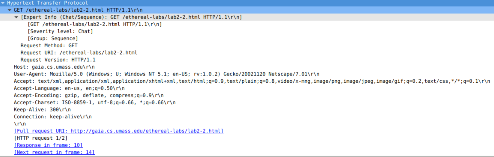
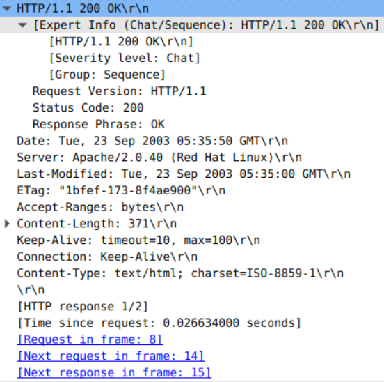
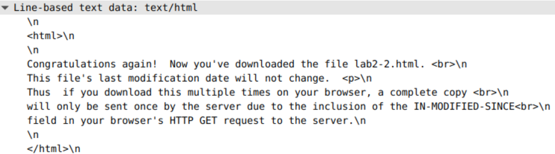
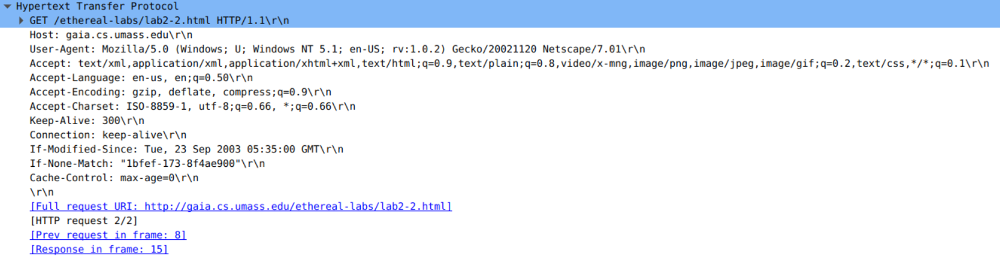
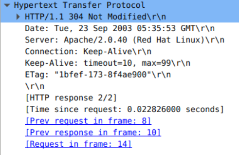

# Lab02

## Question 3

### 1. What is the status code and phrase returned from the server to the client browser?

    Status Code: 200
    Response Phrase: OK

### 2. When was the HTML file that the browser is retrieving last modified at the server? Does the response also contain a DATE header? How are these two fields different?

    Last Modified: 23 September 2003 at 05:29:00 GMT

The response also contains a date header:

    Date: 23 September 2003 at 05:29:50 GMT

The date header differs from the last modified header because:
- The date header defines the time in which the HTTP request is finished. 
- The last modified header is used to assist in decreasing network traffic.

### 3. Is the connection established between the browser and the server persistent or non-persistent? How can you infer this?

The 'Connection: Keep-Alive' header indicates that the connection is **persistent**.

### 4. How many bytes of content are being returned to the browser?

73 Bytes, indicated by the 'Content-Length' header.

### 5. What is the data contained inside the HTTP response packet?

## Question 4

First HTTP request: 

Second HTTP request:

### 1. Inspect the contents of the first HTTP GET request from the browser to the server. Do you see an “IF-MODIFIED-SINCE” line in the HTTP GET?

No, it is not contained in the first HTTP GET.

### 2. Does the response indicate the last time that the requested file was modified?

Yes, on the 23rd of September 2003 05:35:00 GMT.

### 3. Now inspect the contents of the second HTTP GET request from the browser to the server. Do you see an “IF-MODIFIED-SINCE:” and “IF-NONE-MATCH” lines in the HTTP GET? If so, what information is contained in these header lines?

Yes, both are contained in the second HTTP GET request.

If-Modified-Since: Defines the first time in which the resources have been downloaded. 
If-None-Match: contains the etag values.

### 4. What is the HTTP status code and phrase returned from the server in response to this second HTTP GET? Did the server explicitly return the contents of the file? Explain.

    Status code: 304
    Response phrase: Not Modified

The server didn't explicitly return the contents of the file because the data hasn't been modified since last requesting it, meaning that the content is already cached inside local storage. The server doesn't need to inefficiently send another copy of the exact same data.

 ### 5. What is the value of the Etag field in the 2nd response message and how it is used? Has this value changed since the 1st response message was received?