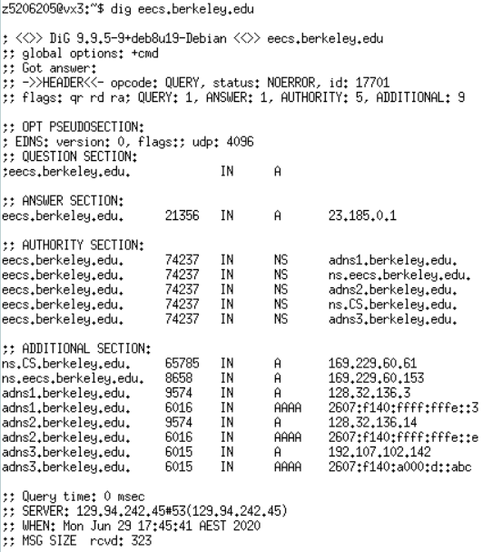

# Lab03

## Digging into DNS

### 1. What is the IP address of www.eecs.berkeley.edu . What type of DNS query is sent to get this answer?

IP Address: 23.185.0.1

DNS Query: Recursion Query

### 2. What is the canonical name for the eecs.berkeley web server? Suggest a reason for having an alias for this server.

Canonical name:
- live-eecs.pantheonsite.io
- fe1.edge.pantheon.io

A reason for having alias' for this server is to have multiple backup addresses. 

### 3. What can you make of the rest of the response (i.e. the details available in the Authority and Additional sections)?

Authority section contains 4 DNS servers.
Additional section contains A(IPV4) and AAAA(IPV6) types. 

### 4. What is the IP address of the local nameserver for your machine?

129.94.242.45

### 5. What are the DNS nameservers for the “ www.eecs.berkeley.edu .” domain (note: the domain name is eecs.berkeley.edu and not www.eecs.berkeley.edu )? Find out their IP addresses? What type of DNS query is sent to obtain this information?

    dig eecs.berkeley.edu

- adns1.berkeley.edu
    - 128.32.136.3
- ns.eecs.berkeley.edu
    - 169.229.60.153
- adns2.berkeley.edu
    - 128.32.136.3
- ns.CS.berkeley.edu
    - 169.229.60.61
- adns3.berkeley.edu
    - 192.107.102.142

### 6. What is the DNS name associated with the IP address 111.68.101.54? What type of DNS query is sent to obtain this information?

OR

- webserver.seecs.nust.edu.pk

### 7. Run dig and query the CSE nameserver (129.94.242.33) for the mail servers for Yahoo! Mail (again the domain name is yahoo.com, not www.yahoo.com ). Did you get an authoritative answer? Why? (HINT: Just because a response contains information in the authoritative part of the DNS response message does not mean it came from an authoritative name server. You should examine the flags in the response to determine the answer)

Because the flags do not contain an "aa" flag, there's no authoritative answer.

### 8. Repeat the above (i.e. Question 7) but use one of the nameservers obtained in Question 5. What is the result?

### 9. Obtain the authoritative answer for the mail servers for Yahoo! mail. What type of DNS query is sent to obtain this information?

Query: MX

- mta5.am0.yahoodns.net
- mta6.am0.yahoodns.net
- mta7.am0.yahoodns.net

### 10. In this exercise you simulate the iterative DNS query process to find the IP address of your machine (e.g. lyre00.cse.unsw.edu.au). First, find the name server (query type NS) of the "." domain (root domain). Query this nameserver to find the authoritative name server for the "au." domain. Query this second server to find the authoritative nameserver for the "edu.au." domain. Now query this nameserver to find the authoritative nameserver for "unsw.edu.au". Next query the nameserver of unsw.edu.au to find the authoritative name server of cse.unsw.edu.au. Now query the nameserver of cse.unsw.edu.au to find the IP address of your host. How many DNS servers do you have to query to get the authoritative answer?

    dig . NS //Get a.root-servers.net ip address
    dig @198.41.0.4 au. -t NS //use this ip to get get a.au ip
    dig @58.65.254.73 edu.au -t NS //use this ip to get q.edu.au ip
    dig @65.22.196.1 unsw.edu.au. -t NS //use this ip to get ns1.unsw.edu.au ip
    dig @129.94.0.192 cse.unsw.edu.au. -t NS //use this ip to get beethoven.orchestra.cse.unsw.edu.au ip
    dig @129.94.208.3 cse.unsw.edu.au. -t A //use this ip to find host name

IP: 129.94.242.53

Obtained by querying 6 DNS servers.

### 11. Can one physical machine have several names and/or IP addresses associated with it?

Yes, because an IP address is allowed to have multiple alias'.